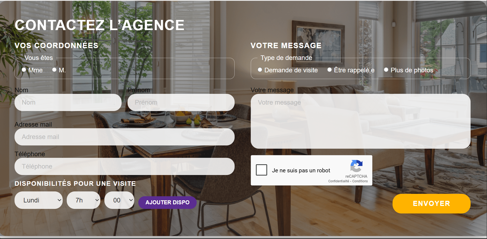

# Test Dev Web Tremplin


## 📢 Rendu

> **Rendre le projet sur GitHub** (dépôt **public**)  
> Envoyer le lien à **production@majordhom.fr**  
> _(Je ne consulterai pas les fichiers ZIP.)_

---

## 👤 À propos de moi

- **Nom / Prénom** : SISSOKO Mamadou  
- **Niveau d’étude** : Étudiant en 1ère année du cycle ingénieur (ESEO Angers)  
- **Durée du stage** : 4 mois (21 juillet – 20 novembre 2025)  


## 📸 Aperçu




## 🚀 Installation & lancement

1. **Cloner le dépôt**  
   ```bash
   git clone https://github.com/ms05-hub/test-tremplin.git
   cd test-tremplin
2. **Copier et configurer .env**
  cp .env.example .env
Éditez ensuite .env et renseignez vos clés:
# Base de données
DB_HOST=db
DB_NAME=test_tremplin
DB_USER=root
DB_PASS=verysecurepassword
DB_CHARSET=utf8mb4

# SMTP (Mailtrap pour tests)
SMTP_HOST=sandbox.smtp.mailtrap.io
SMTP_PORT=2525
SMTP_USER=<VOTRE_USER_MAILTRAP>
SMTP_PASS=<VOTRE_PASS_MAILTRAP>

# Expéditeur & notifications
MAIL_FROM_ADDRESS=no-reply@monsite.test
MAIL_FROM_NAME="Agence Immobilière"
AGENCY_EMAIL=votre.adresse@exemple.test

# Google reCAPTCHA v2
RECAPTCHA_SITEKEY=<VOTRE_SITE_KEY>
RECAPTCHA_SECRET=<VOTRE_SECRET_KEY>
3. **Lancer Docker Compose**
   docker compose up -d
4. **Accéder**
        Formulaire : http://localhost

        phpMyAdmin : http://localhost:8080
        (login : root / mot de passe : verysecurepassword)

Fonctionnalités

  1. **Intégration front**

      .Flexbox / media queries

      .Respect exacte de la maquette (marges, typographie, arrondis)

  2. **Back-end PHP natif**

      .Formulaire traité dans public/index.php

      .Sécurisation :

          -CSRF token

          -Honeypot anti-spam

          -Validation serveurs (email, téléphone, champs obligatoires)

      . PDO + transactions + Post–Redirect–Get

  3. **Disponibilités en JS “vanilla”**

      .Ajout dynamique de créneaux

      .Encodage jour|heure|minute dans disponibilites[]

  4. **Envoi d’e-mails**

      .PHPMailer + Mailtrap pour tests

      .Notification à l’agence et accusé de réception au client

  5. **Google reCAPTCHA v2**

      .Widget “Je ne suis pas un robot”

      .Vérification serveur avant traitement

  6. **Infrastructure Docker Compose**

      .Apache/PHP 8.3, MySQL 8.4, phpMyAdmin

      .phpdotenv pour gérer la config

❓ Retour sur les questions

    .Facilité / difficultés

        Intégration front & PDO : maîtrisé

        SMTP/Mailtrap et reCAPTCHA : un peu plus long à configurer

    .Outils découverts / utilisés

        phpdotenv pour externaliser la config

        PHPMailer pour un envoi d’e-mails fiable

        Google reCAPTCHA pour la protection anti-spam

    .Pourquoi ces choix ?

        Separation config/code (dotenv)

        Fiabilité TLS/SMTP (PHPMailer)

        Sécurité rapide (reCAPTCHA)

    .Stack & Docker

        J’ai utilisé la stack LAMP + phpMyAdmin fournie par Docker Compose

        J’utilise Docker quotidiennement pour des environnements reproductibles


Pistes d’évolution

    Migration vers un framework (Laravel, Symfony…)

    Front-end SPA (React, Vue ou Next.js)

    reCAPTCHA v3 invisible pour meilleure UX

    Tableau de bord admin pour gérer les demandes

